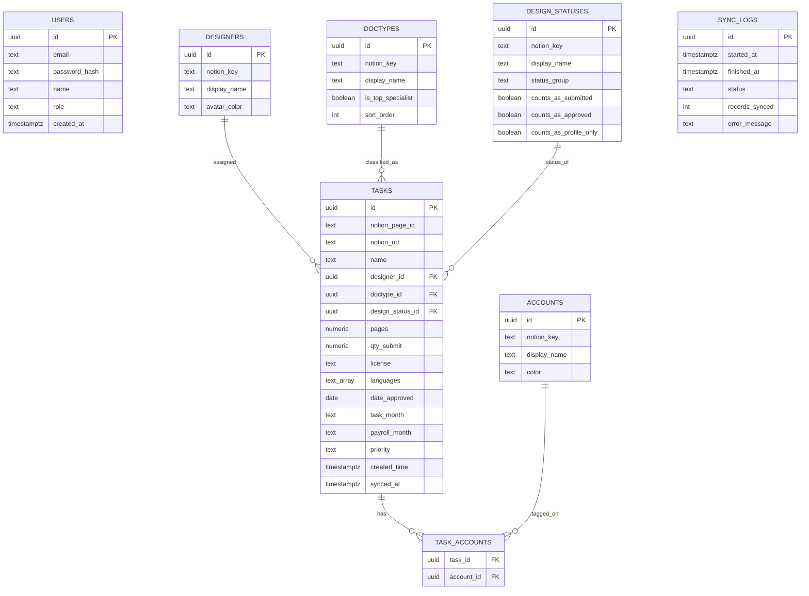

# PRD — Dashboard Module
**Product:** CAN-Freelance — Report and Payroll
**Module:** Dashboard (home page)
**Author:** Product spec generated with Claude, based on wireframe review + Notion database "🥷🏼 Impro Freelance"
**Status:** Draft v1 — ready for build
**Stack:** Next.js (App Router) + Tailwind CSS + PostgreSQL + Prisma + Node.js sync worker

---

## 1. Purpose

CAN-Freelance produces Canva templates for multiple client brands using a freelance designer team. Production data currently lives in Notion. Managerial/owner-level users need a single read-only dashboard that answers, at a glance:

- How much work is being produced, and is it trending up or down?
- Which brands/accounts are driving volume?
- Are designers keeping pace, and what's their approval quality?
- What's the mix of doctype, license, and language across output?

The Notion board stays the system of record for production work. This dashboard is a **read-only reporting layer** synced from Notion into Postgres on a schedule, so managerial reporting doesn't hit Notion's plan limits (the connected workspace does not have Notion AI / Business-plan SQL query access) and loads fast even with growing history.

## 2. Users

Single role for v1: **Manager/Owner** (the "IS" avatar in the wireframe). No client-facing or designer-facing views in this module. Multi-role access can be added later (see Open Questions).

## 3. Scope (this PRD)

In scope: Dashboard page only — global filters, 5 KPI cards, 9 chart/table widgets, Notion Sync trigger, sync status indicator.

> **Revision note (v2):** wireframe redesign added a Task Pipeline widget, split "License & Bahasa" into two standalone gauge widgets, added summary badges to most widgets (e.g. "AVG.32 TASK"), added hover tooltips to the trend/donut charts, and added a top-performer badge to the Designer Leaderboard. See §5 and §6 for the updated rules and widget list.
Out of scope (future modules, not detailed here): Production, Account & Team, Rate Card, Billing Statement, Analytics & Reports (sidebar items).

## 4. Data Source

**Notion database:** 🥷🏼 Impro Freelance (`2f40e19aa1358026a0e1d9caab5cdbb7`)
**Sync method:** Official Notion REST API (`@notionhq/client`), NOT the AI/SQL query endpoints (unavailable on current plan). Paginated `dataSources.query`, upserted into Postgres keyed by Notion page ID.
**Sync trigger:** scheduled cron (default every 15 min, configurable) + manual "Notion Sync" button in the sidebar.
**Direction:** Notion → Postgres only, one-way. Dashboard never writes back to Notion in v1.

### Notion → Postgres field mapping

| Notion property | Type | Postgres target |
|---|---|---|
| Name | title | `tasks.name` |
| Designer | select (4 options) | `tasks.designer_id` → `designers` lookup |
| Doctype | select (17 options) | `tasks.doctype_id` → `doctypes` lookup |
| Design Status | status (8 options) | `tasks.design_status_id` → `design_statuses` lookup |
| Account | multi-select (6 options) | `task_accounts` join table → `accounts` lookup |
| Task Month | select (Month-Year) | `tasks.task_month` (stored, not used for dashboard filtering) |
| Payroll Month | select (Month-Year) | `tasks.payroll_month` (stored, not used for dashboard filtering) |
| Pages | number | `tasks.pages` |
| QTY-Submit | number | `tasks.qty_submit` |
| IND/ENG | multi-select | `tasks.languages` (text array) |
| License | select (Free/Pro) | `tasks.license` |
| Date Aproved | date | `tasks.date_approved` |
| Priority | select | `tasks.priority` |
| Created time | created_time | `tasks.created_time` — **drives all dashboard date filtering** |
| Notion page URL | — | `tasks.notion_url`, `tasks.notion_page_id` (unique key for upsert) |

### Terminology (confirmed)

- **"Task"** = one Notion card = one row in `tasks`. This is what `Total Task`, `Tren Volume Task`, `Task Pipeline`, and the Designer Leaderboard's task counts all measure (row counts).
- **"Template"** = the `QTY-Submit` field. This is what `Total Template`, `Distribusi Template`, `Lisensi Template`, and `Bahasa Template` all measure (`SUM(qty_submit)`), and is distinct from task count — one task/card can represent multiple templates.
- **"Design pages"** = the `Pages` field. Not used by any Dashboard widget in this module, but this is the field the future **Rate Card** module will use for payout calculation (IDR 15,000/page base rate, with a per-doctype poll-rate multiplier — see conversation notes for Infographic-Sosmed's 1.5× rate).

## 5. Confirmed Business Rules

These were clarified during requirements review and are binding for all widgets below:

- **"Submitted"** = all tasks where `design_status != 'Draft'`.
- **Approval Rate numerator** = `SUM(qty_submit)` where `design_status = 'Aproved'`.
- **Aproved-Profile Only numerator** = `SUM(qty_submit)` where `design_status = 'Aproved-Profile Only'`.
- **All date-based filtering and charting** (month picker, trend chart, "X bulan terakhir" windows) is driven by `created_time`, not Task Month / Payroll Month. Those two fields are retained in the schema for payroll-reporting use in a later module only.
- **"6 bulan terakhir"** is a **rolling window of 6 calendar months ending at the latest month with synced data** (superseding the earlier fixed-anchor-at-contract-start rule). As new months of data arrive, the window slides forward and the oldest month drops off.
- **Designer Leaderboard "Other" column** = task count for all doctypes outside the global top-3-by-volume (currently Regular-Presentation, Infographic-Slides, Regular-Sosmed), rolled up per designer. Top-3 set is config-driven (`doctypes.is_top_specialist`), not hardcoded, so it can be revisited without a code change. The "Other" tooltip lists only the non-zero doctypes for that designer/period.
- **Designer Leaderboard top-performer badge** ("🏆 [Name]") — assumed default: designer with the highest `task_total` in the selected period; ties broken alphabetically by display name. **Flagged for confirmation** — not yet explicitly specified.
- **Task Pipeline "in queue"** = count of all tasks where `design_status` is **not** "Aproved" and **not** "Aproved-Profile Only" (i.e. everything still in Draft, Not Started, In Progress, QA, In Review, or Reject). Confirmed.
- **Brand tab filter** ("Semua Brand" vs one brand): selecting a single brand filters every widget's underlying query by that Account. The Tren Volume Task chart switches from 5-series stacked area to single-series chart when one brand is selected; Lisensi Template and Bahasa Template gauges recalculate their totals for the filtered set; tables/leaderboards hide rows with zero activity for that brand.
- **Zero-value legend items** (e.g. a brand with 0 tasks in the selected period) render as a muted/gray swatch rather than being hidden, so the color key stays stable across period changes.
- **Hover tooltips** on Tren Volume Task (per month/brand data point) and Distribusi Template (per brand donut segment) show the **top 3 doctypes by volume** for that brand in that month, as a name-only list (no counts shown in the tooltip itself).
- **Display name mapping** (Notion value → dashboard label) is stored per lookup row so brand/doctype labels can differ from Notion's raw names without code changes: `Improstudio→Improstd`, `Azzahra→Zahra Art`, `Chital→Chital Graphic`, `uicreative→Ui Creative.net`, `Antler→Antler`, `Teman Siswa→Teman Siswa`.

### Known build-time watch-items (not spec changes, flagged from wireframe QA)
- In the redesigned mockup, the **Task Pipeline** and **Kategori Doctype** (ranking) bar charts did not visibly recalculate when a single brand was selected (bars stayed identical to "Semua Brand" while only the summary badge updated). The queries in §11 already filter by `:account_id` correctly — make sure the frontend actually re-fetches/re-renders these two widgets on brand-tab change during implementation.
- The designer-workload widget was mistakenly labeled "Kategori Doctype" in the wireframe (duplicating the doctype-ranking widget's name) with a "AVG.16 PAGES" badge. It has been renamed **"Workload per Designer"** and measures **task count** (same metric as the original "Beban Kerja per Designer" widget) — the badge should read "AVG.X TASK", not pages.

## 6. Widget Specification

| # | Widget | Type | Data | Badge | Filter-aware |
|---|---|---|---|---|---|
| 1 | Total Task | KPI card | Count of tasks in period, vs prior period | — | brand, period |
| 2 | Total Template | KPI card | SUM(qty_submit) in period, vs prior period | — | brand, period |
| 3 | Approval Rate | KPI card | SUM(qty_submit) Aproved / SUM(qty_submit) submitted | — | brand, period |
| 4 | Aproved-Profile Only | KPI card | SUM(qty_submit) Aproved-Profile Only / SUM(qty_submit) submitted | — | brand, period |
| 5 | Total Doctype | KPI card | COUNT(DISTINCT doctype) with ≥1 task, rolling 6 months | — | brand, period |
| 6 | Tren Volume Task | Stacked/single area or bar chart | Task count per month per brand, rolling 6 months. Hover tooltip = top-3 doctypes for that brand/month | "AVG.X TASK" (mean tasks/month) | brand, period |
| 7 | Distribusi Template | Donut | SUM(qty_submit) per brand, rolling 6 months. Hover tooltip = top-3 doctypes for that brand | "AVG.X TEMPLATE" (mean templates/month) | period (single-brand view collapses to one full-color ring) |
| 8 | Task Pipeline | Horizontal bar | Task count per Design Status stage (Draft, Not Started, In Progress, QA, In Review, Aproved, Profile Only) | "X TASK" + "Y TEMPLATE" (both = in-queue subset, i.e. all stages except Aproved & Profile Only — X is row count, Y is SUM(qty_submit)) | brand, period |
| 9 | Kategori Doctype | Bar chart | Task count per doctype, ranked desc, all doctypes shown | "X DOCTYPE" (distinct doctypes with ≥1 task) | brand, period |
| 10 | Lisensi Template | Gauge (half-donut) | Count by License: Pro vs Free, rolling 6 months, totals only | total templates | brand, period |
| 11 | Bahasa Template | Gauge (half-donut) | Count by Language: ENG vs IND, rolling 6 months, totals only | total templates | brand, period |
| 12 | Aproved-Profile Only (table) | Table | Doctype × License × Language × Account × QTY, status = Aproved-Profile Only, rolling 6 months | "X TEMPLATE" | brand, period |
| 13 | Workload per Designer | Horizontal bar | Task count per designer, rolling 6 months (renamed from "Beban Kerja per Designer"; do not reuse "Kategori Doctype" as its title) | "AVG.X TASK" (mean tasks/designer) | brand, period |
| 14 | Designer Leaderboard | Table | Task count, Approval %, top-3 doctype breakdown + Other, per designer | "🏆 [top designer]" | brand, period |

## 7. Non-Functional Requirements

- Dashboard reads only from Postgres — no live Notion calls on page load.
- Sync job must be idempotent (safe to re-run, upsert by `notion_page_id`).
- Sync failures must not corrupt existing data — failed sync leaves last-good state in place and logs to `sync_logs`.
- Local-first: runs via `docker-compose` (Postgres only) + `next dev`, no external hosting dependency for v1.
- Single-user auth (session-based) is sufficient for v1.

## 8. Open Questions (not blocking, flag for later)

- Multi-brand tasks: a task can carry >1 Account in Notion. Confirm whether such a task should count toward *both* brands' totals (current design: yes, via join table) or only a primary brand.
- Should the manual "Notion Sync" button be disabled/show a spinner while a sync is in progress, and should concurrent syncs be locked at the DB level?
- Future: role-based access if client-facing brand-specific views are ever needed.

---

## 9. ERD



## 10. Schema DDL (PostgreSQL)

```sql
CREATE TABLE designers (
    id UUID PRIMARY KEY DEFAULT gen_random_uuid(),
    notion_key TEXT UNIQUE NOT NULL,      -- e.g. 'Putry'
    display_name TEXT NOT NULL,
    avatar_color TEXT
);

CREATE TABLE doctypes (
    id UUID PRIMARY KEY DEFAULT gen_random_uuid(),
    notion_key TEXT UNIQUE NOT NULL,      -- e.g. 'Regular-Sosmed'
    display_name TEXT NOT NULL,
    is_top_specialist BOOLEAN NOT NULL DEFAULT false,
    sort_order INT DEFAULT 0
);

CREATE TABLE accounts (
    id UUID PRIMARY KEY DEFAULT gen_random_uuid(),
    notion_key TEXT UNIQUE NOT NULL,      -- e.g. 'Improstudio'
    display_name TEXT NOT NULL,           -- e.g. 'Improstd'
    color TEXT
);

CREATE TABLE design_statuses (
    id UUID PRIMARY KEY DEFAULT gen_random_uuid(),
    notion_key TEXT UNIQUE NOT NULL,      -- e.g. 'Aproved'
    display_name TEXT NOT NULL,
    status_group TEXT,                    -- to_do / in_progress / complete
    counts_as_submitted BOOLEAN NOT NULL DEFAULT true,  -- false only for 'Draft'
    counts_as_approved BOOLEAN NOT NULL DEFAULT false,  -- true only for 'Aproved'
    counts_as_profile_only BOOLEAN NOT NULL DEFAULT false -- true only for 'Aproved-Profile Only'
);

CREATE TABLE tasks (
    id UUID PRIMARY KEY DEFAULT gen_random_uuid(),
    notion_page_id TEXT UNIQUE NOT NULL,
    notion_url TEXT,
    name TEXT,
    designer_id UUID REFERENCES designers(id),
    doctype_id UUID REFERENCES doctypes(id),
    design_status_id UUID REFERENCES design_statuses(id),
    pages NUMERIC,
    qty_submit NUMERIC,
    license TEXT,                          -- 'Free' | 'Pro'
    languages TEXT[],                      -- ['IND'], ['ENG'], or both
    date_approved DATE,
    task_month TEXT,                       -- kept for payroll module, not used here
    payroll_month TEXT,                    -- kept for payroll module, not used here
    priority TEXT,
    created_time TIMESTAMPTZ NOT NULL,      -- drives all dashboard filtering
    synced_at TIMESTAMPTZ NOT NULL DEFAULT now()
);
CREATE INDEX idx_tasks_created_time ON tasks(created_time);
CREATE INDEX idx_tasks_designer ON tasks(designer_id);
CREATE INDEX idx_tasks_doctype ON tasks(doctype_id);
CREATE INDEX idx_tasks_status ON tasks(design_status_id);

CREATE TABLE task_accounts (
    task_id UUID REFERENCES tasks(id) ON DELETE CASCADE,
    account_id UUID REFERENCES accounts(id) ON DELETE CASCADE,
    PRIMARY KEY (task_id, account_id)
);
CREATE INDEX idx_task_accounts_account ON task_accounts(account_id);

CREATE TABLE sync_logs (
    id UUID PRIMARY KEY DEFAULT gen_random_uuid(),
    started_at TIMESTAMPTZ NOT NULL DEFAULT now(),
    finished_at TIMESTAMPTZ,
    status TEXT,                           -- 'running' | 'success' | 'failed'
    records_synced INT,
    error_message TEXT
);

CREATE TABLE users (
    id UUID PRIMARY KEY DEFAULT gen_random_uuid(),
    email TEXT UNIQUE NOT NULL,
    password_hash TEXT NOT NULL,
    name TEXT,
    role TEXT DEFAULT 'manager',
    created_at TIMESTAMPTZ NOT NULL DEFAULT now()
);
```

## 11. Widget Queries

Assumes parameters: `:period_start`, `:period_end` (derived from selected month / trailing-6-months window), `:account_id` (nullable — NULL means "Semua Brand").

**1–5. KPI cards**

```sql
-- Total Task (current period)
SELECT COUNT(DISTINCT t.id) AS total_task
FROM tasks t
LEFT JOIN task_accounts ta ON ta.task_id = t.id
WHERE t.created_time BETWEEN :period_start AND :period_end
  AND (:account_id IS NULL OR ta.account_id = :account_id);

-- Total Template (SUM qty_submit)
SELECT COALESCE(SUM(t.qty_submit), 0) AS total_template
FROM tasks t
LEFT JOIN task_accounts ta ON ta.task_id = t.id
WHERE t.created_time BETWEEN :period_start AND :period_end
  AND (:account_id IS NULL OR ta.account_id = :account_id);

-- Approval Rate
SELECT
  COALESCE(SUM(t.qty_submit) FILTER (WHERE ds.counts_as_approved), 0) AS approved_qty,
  COALESCE(SUM(t.qty_submit) FILTER (WHERE ds.counts_as_submitted), 0) AS submitted_qty,
  ROUND(
    100.0 * COALESCE(SUM(t.qty_submit) FILTER (WHERE ds.counts_as_approved), 0)
    / NULLIF(SUM(t.qty_submit) FILTER (WHERE ds.counts_as_submitted), 0), 1
  ) AS approval_rate_pct
FROM tasks t
JOIN design_statuses ds ON ds.id = t.design_status_id
LEFT JOIN task_accounts ta ON ta.task_id = t.id
WHERE t.created_time BETWEEN :period_start AND :period_end
  AND (:account_id IS NULL OR ta.account_id = :account_id);

-- Aproved-Profile Only Rate (same shape, swap counts_as_profile_only)
SELECT
  ROUND(
    100.0 * COALESCE(SUM(t.qty_submit) FILTER (WHERE ds.counts_as_profile_only), 0)
    / NULLIF(SUM(t.qty_submit) FILTER (WHERE ds.counts_as_submitted), 0), 1
  ) AS profile_only_rate_pct
FROM tasks t
JOIN design_statuses ds ON ds.id = t.design_status_id
LEFT JOIN task_accounts ta ON ta.task_id = t.id
WHERE t.created_time BETWEEN :period_start AND :period_end
  AND (:account_id IS NULL OR ta.account_id = :account_id);

-- Total Doctype (distinct doctypes with ≥1 task)
SELECT COUNT(DISTINCT t.doctype_id) AS total_doctype
FROM tasks t
LEFT JOIN task_accounts ta ON ta.task_id = t.id
WHERE t.created_time BETWEEN :period_start AND :period_end
  AND (:account_id IS NULL OR ta.account_id = :account_id);
```

**6. Tren Volume Task** (multi-brand stacked, or single-brand when filtered)

`:period_start`/`:period_end` here are computed as the rolling 6-month window ending at the latest month present in `tasks.created_time` (not a fixed calendar anchor).

```sql
SELECT
  date_trunc('month', t.created_time) AS month,
  a.display_name AS brand,
  COUNT(DISTINCT t.id) AS task_count
FROM tasks t
JOIN task_accounts ta ON ta.task_id = t.id
JOIN accounts a ON a.id = ta.account_id
WHERE t.created_time BETWEEN :period_start AND :period_end
  AND (:account_id IS NULL OR ta.account_id = :account_id)
GROUP BY 1, 2
ORDER BY 1, 2;

-- Hover tooltip: top-3 doctypes for a given brand + month
SELECT dt.display_name AS doctype, COUNT(*) AS task_count
FROM tasks t
JOIN task_accounts ta ON ta.task_id = t.id
JOIN doctypes dt ON dt.id = t.doctype_id
WHERE ta.account_id = :account_id
  AND date_trunc('month', t.created_time) = :month
GROUP BY dt.display_name
ORDER BY task_count DESC
LIMIT 3;
```

**7. Distribusi Template** (renamed from "Grafik Distribusi Template")

```sql
SELECT a.display_name AS brand, COALESCE(SUM(t.qty_submit), 0) AS templates
FROM tasks t
JOIN task_accounts ta ON ta.task_id = t.id
JOIN accounts a ON a.id = ta.account_id
WHERE t.created_time BETWEEN :period_start AND :period_end
GROUP BY a.display_name
ORDER BY templates DESC;

-- Hover tooltip: top-3 doctypes for a given brand across the whole period
SELECT dt.display_name AS doctype, COUNT(*) AS task_count
FROM tasks t
JOIN task_accounts ta ON ta.task_id = t.id
JOIN doctypes dt ON dt.id = t.doctype_id
WHERE ta.account_id = :account_id
  AND t.created_time BETWEEN :period_start AND :period_end
GROUP BY dt.display_name
ORDER BY task_count DESC
LIMIT 3;
```

**8. Task Pipeline** (new widget)

```sql
SELECT ds.display_name AS stage, COUNT(*) AS task_count
FROM tasks t
JOIN design_statuses ds ON ds.id = t.design_status_id
LEFT JOIN task_accounts ta ON ta.task_id = t.id
WHERE t.created_time BETWEEN :period_start AND :period_end
  AND (:account_id IS NULL OR ta.account_id = :account_id)
GROUP BY ds.display_name, ds.status_group
ORDER BY ds.status_group;

-- "X TASK IN QUEUE" badge = everything except Aproved & Profile Only
SELECT COUNT(*) AS in_queue
FROM tasks t
JOIN design_statuses ds ON ds.id = t.design_status_id
LEFT JOIN task_accounts ta ON ta.task_id = t.id
WHERE NOT ds.counts_as_approved
  AND NOT ds.counts_as_profile_only
  AND t.created_time BETWEEN :period_start AND :period_end
  AND (:account_id IS NULL OR ta.account_id = :account_id);

-- "Y TEMPLATE" badge = SUM(qty_submit) for the same in-queue subset
SELECT COALESCE(SUM(t.qty_submit), 0) AS in_queue_templates
FROM tasks t
JOIN design_statuses ds ON ds.id = t.design_status_id
LEFT JOIN task_accounts ta ON ta.task_id = t.id
WHERE NOT ds.counts_as_approved
  AND NOT ds.counts_as_profile_only
  AND t.created_time BETWEEN :period_start AND :period_end
  AND (:account_id IS NULL OR ta.account_id = :account_id);
```

**12. Aproved-Profile Only table** (now includes Account column)

```sql
SELECT
  d.display_name AS doctype,
  t.license,
  unnest(t.languages) AS language,
  string_agg(DISTINCT a.display_name, ', ') AS account,
  SUM(t.qty_submit) AS qty
FROM tasks t
JOIN doctypes d ON d.id = t.doctype_id
JOIN design_statuses ds ON ds.id = t.design_status_id
LEFT JOIN task_accounts ta ON ta.task_id = t.id
LEFT JOIN accounts a ON a.id = ta.account_id
WHERE ds.counts_as_profile_only
  AND t.created_time BETWEEN :period_start AND :period_end
  AND (:account_id IS NULL OR ta.account_id = :account_id)
GROUP BY 1, 2, 3
ORDER BY qty DESC;
```

**10. Lisensi Template** (gauge — replaces the license half of "License & Bahasa")

```sql
SELECT t.license, COALESCE(SUM(t.qty_submit), 0) AS templates
FROM tasks t
LEFT JOIN task_accounts ta ON ta.task_id = t.id
WHERE t.created_time BETWEEN :period_start AND :period_end
  AND (:account_id IS NULL OR ta.account_id = :account_id)
GROUP BY t.license;
```

**11. Bahasa Template** (gauge — replaces the language half of "License & Bahasa")

```sql
SELECT unnest(t.languages) AS language, COALESCE(SUM(t.qty_submit), 0) AS templates
FROM tasks t
LEFT JOIN task_accounts ta ON ta.task_id = t.id
WHERE t.created_time BETWEEN :period_start AND :period_end
  AND (:account_id IS NULL OR ta.account_id = :account_id)
GROUP BY 1;
```

**9. Kategori Doctype** (doctype ranking — distinct from "Workload per Designer" below; do not conflate the two)

```sql
SELECT d.display_name AS doctype, COUNT(*) AS task_count
FROM tasks t
JOIN doctypes d ON d.id = t.doctype_id
LEFT JOIN task_accounts ta ON ta.task_id = t.id
WHERE t.created_time BETWEEN :period_start AND :period_end
  AND (:account_id IS NULL OR ta.account_id = :account_id)
GROUP BY d.display_name
ORDER BY task_count DESC;
```

**13. Workload per Designer** (renamed from "Beban Kerja per Designer"; metric = task count, not pages)

```sql
SELECT ds.display_name AS designer, COUNT(*) AS task_count
FROM tasks t
JOIN designers ds ON ds.id = t.designer_id
LEFT JOIN task_accounts ta ON ta.task_id = t.id
WHERE t.created_time BETWEEN :period_start AND :period_end
  AND (:account_id IS NULL OR ta.account_id = :account_id)
GROUP BY ds.display_name
ORDER BY task_count DESC;
```

**14. Designer Leaderboard** (top-3 doctypes as columns + Other rollup, plus top-performer badge)

```sql
WITH base AS (
  SELECT
    des.id AS designer_id,
    des.display_name AS designer,
    t.id AS task_id,
    t.qty_submit,
    dt.display_name AS doctype,
    dt.is_top_specialist,
    dstat.counts_as_approved
  FROM tasks t
  JOIN designers des ON des.id = t.designer_id
  JOIN doctypes dt ON dt.id = t.doctype_id
  JOIN design_statuses dstat ON dstat.id = t.design_status_id
  LEFT JOIN task_accounts ta ON ta.task_id = t.id
  WHERE t.created_time BETWEEN :period_start AND :period_end
    AND (:account_id IS NULL OR ta.account_id = :account_id)
)
SELECT
  designer,
  COUNT(*) AS task_total,
  ROUND(100.0 * COUNT(*) FILTER (WHERE counts_as_approved) / NULLIF(COUNT(*), 0), 0) AS approval_pct,
  COUNT(*) FILTER (WHERE doctype = 'Regular-Presentation') AS regular_presentation,
  COUNT(*) FILTER (WHERE doctype = 'Infographic-Slides') AS infographic_slides,
  COUNT(*) FILTER (WHERE doctype = 'Regular-Sosmed') AS regular_sosmed,
  COUNT(*) FILTER (WHERE NOT is_top_specialist) AS other_count
FROM base
GROUP BY designer
ORDER BY task_total DESC;

-- "Other" breakdown for tooltip (non-zero doctypes only), per designer
SELECT dt.display_name AS doctype, COUNT(*) AS qty
FROM tasks t
JOIN doctypes dt ON dt.id = t.doctype_id
WHERE t.designer_id = :designer_id
  AND dt.is_top_specialist = false
  AND t.created_time BETWEEN :period_start AND :period_end
GROUP BY dt.display_name
HAVING COUNT(*) > 0
ORDER BY qty DESC;

-- "🏆 [Name]" badge — top performer by task_total, tie broken alphabetically
-- (assumption pending confirmation — see §5)
WITH base AS (
  SELECT des.display_name AS designer, COUNT(*) AS task_total
  FROM tasks t
  JOIN designers des ON des.id = t.designer_id
  LEFT JOIN task_accounts ta ON ta.task_id = t.id
  WHERE t.created_time BETWEEN :period_start AND :period_end
    AND (:account_id IS NULL OR ta.account_id = :account_id)
  GROUP BY des.display_name
)
SELECT designer FROM base
ORDER BY task_total DESC, designer ASC
LIMIT 1;
```

---

*Next: once this module is approved, we move to the Production module PRD (sidebar item 2).*
